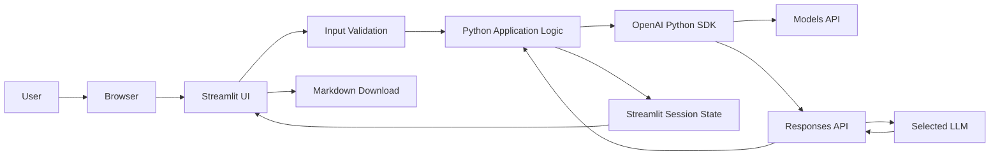

# Challenge 01: Build Your First LLM Application

## 1. What did we build?

We built a small but complete **LLM-powered meeting assistant**.

The application allows a user to:

- paste meeting notes,
- choose an approved OpenAI model,
- send the notes to an LLM,
- receive a structured meeting analysis,
- keep the result available during the browser session,
- download the analysis as a Markdown file,
- view token usage for the API request.

The generated analysis contains:

- an executive summary,
- key decisions,
- action items,
- owners,
- deadlines,
- risks,
- open questions.

Although the application is intentionally simple, it already demonstrates the complete flow of an enterprise AI application:

```text
User interface
    ↓
Application logic
    ↓
Input validation
    ↓
External AI API
    ↓
LLM response
    ↓
Session state
    ↓
Formatted result
```

---

## 2. Why did we build it?

The goal was not merely to call an LLM.

The goal was to understand the basic building blocks of a real AI application by creating something useful.

Meeting notes are a good first enterprise use case because companies regularly need to transform unstructured text into structured information.

A meeting assistant can help employees:

- reduce manual note-taking,
- identify decisions,
- track actions and owners,
- surface unresolved risks,
- prepare follow-up communication,
- create a searchable record of meetings.

This makes the project simple enough to understand while still representing a real business problem.

---

## 3. Final application capabilities

The completed first version includes the following features.

### User interface

- Streamlit web application
- model selector
- meeting-notes text area
- analyze button
- loading spinner
- formatted Markdown output
- download button
- token usage metrics

### API integration

- OpenAI Python SDK
- model discovery through the models API
- approved model allowlist
- OpenAI Responses API
- separate application instructions and user input

### Application behavior

- input validation
- maximum character limit
- session-state persistence
- exception handling
- reusable `analyze_meeting()` function

### Security

- API key stored in `.env`
- `.env` excluded from Git
- `.env.example` included as a template
- restricted API key permissions
- least-privilege access

---

## 4. Architecture



### Architecture explanation

The user interacts with a Streamlit application in the browser.

Streamlit sends the submitted input to the Python application. Before any external API request is made, the application validates the input.

The Python application uses the OpenAI SDK to communicate with the OpenAI API.

Two OpenAI API operations are used:

1. Retrieve available model identifiers.
2. Create a model response from meeting notes.

The selected LLM processes the notes and returns a structured response.

The application stores the generated analysis and usage information in Streamlit session state. This allows the result to remain visible when Streamlit reruns the script after user interaction.

The user can then read the formatted result or download it as a Markdown file.

---

## 5. Project structure

```text
AI-Architecture-Playbook/
│
├── .gitignore
├── .venv/
│
├── docs/
│   └── 01-ai-fundamentals/
│       └── challenge-01-first-llm-app.md
│
└── projects/
    └── first-llm-app/
        ├── app.py
        ├── README.md
        ├── requirements.txt
        ├── .env
        └── .env.example
```

### File responsibilities

| File | Purpose |
|---|---|
| `app.py` | Main Streamlit application |
| `README.md` | Setup and run instructions for the project |
| `requirements.txt` | Direct Python dependencies |
| `.env` | Local secret values such as the real API key |
| `.env.example` | Safe template showing required environment variables |
| `.gitignore` | Prevents secrets, virtual environments, and generated files from being committed |
| `challenge-01-first-llm-app.md` | Learning documentation for the Playbook website |

---

## 6. Development environment

### Python

We used Python 3.10.11.

The version was checked with:

```powershell
python --version
```

### Virtual environment

A virtual environment was created in the repository root:

```powershell
python -m venv .venv
```

It was activated in PowerShell with:

```powershell
.\.venv\Scripts\Activate.ps1
```

When active, the terminal shows:

```text
(.venv)
```

The virtual environment isolates the project dependencies from the global Python installation.

This prevents conflicts between projects that may require different versions of the same library.

### Dependencies

The project uses three direct dependencies:

```text
streamlit
openai
python-dotenv
```

They were installed with:

```powershell
pip install -r projects/first-llm-app/requirements.txt
```

Pip also installed many indirect dependencies required by these libraries.

For example:

```text
streamlit
├── pandas
├── numpy
├── pillow
├── requests
└── altair
```

The application declares only its direct dependencies. Pip resolves the remaining dependency tree automatically.

---

## 7. Git and repository hygiene

The project uses Git for version control and GitHub as the remote repository.

The workflow was:

```text
Edit files locally
    ↓
Review changes in Source Control
    ↓
Commit
    ↓
Push to GitHub
```

The root `.gitignore` contains:

```gitignore
.venv/
**/.env
__pycache__/
*.pyc
```

### Why these entries are ignored

#### `.venv/`

The virtual environment contains installed libraries and machine-specific files. It can be recreated from `requirements.txt` and should not be committed.

#### `**/.env`

The `.env` file contains secrets. The `**` pattern ensures that every `.env` file anywhere in the repository is ignored.

#### `__pycache__/` and `*.pyc`

These files are generated automatically by Python and do not belong in source control.

### `.env` versus `.env.example`

The real local file contains the actual secret:

```text
OPENAI_API_KEY=sk-...
```

The public template contains only a placeholder:

```text
OPENAI_API_KEY=your-api-key-here
```

This separation documents the required configuration without exposing credentials.

---

## 8. API key permissions and least privilege

The API key was configured with restricted permissions.

The application only needs:

```text
List models  → Read
Responses    → Write
```

This follows the security principle of **least privilege**:

> A credential should have only the permissions required for its current task.

The application does not need access to images, files, fine-tuning, assistants, or other API operations.

If the key is accidentally exposed, restricted permissions reduce the potential impact.

---

## 9. Loading the API key

The application loads environment variables with `python-dotenv`.

```python
from dotenv import load_dotenv

load_dotenv()
```

The key is then read with:

```python
import os

api_key = os.getenv("OPENAI_API_KEY")
```

The application checks whether the key exists:

```python
if not api_key:
    st.error("OPENAI_API_KEY was not found in the .env file.")
    st.stop()
```

This prevents the application from continuing with an invalid configuration.

---

## 10. Creating the OpenAI client

The OpenAI Python client is created with:

```python
from openai import OpenAI

client = OpenAI(api_key=api_key)
```

The client is a Python object that provides methods for interacting with the OpenAI API.

Instead of manually creating HTTP requests, the SDK exposes operations such as:

```python
client.models.list()
```

and:

```python
client.responses.create(...)
```

The SDK handles details such as:

- request formatting,
- authorization headers,
- JSON serialization,
- response parsing,
- Python response objects.

---

## 11. APIs and endpoints

An API is an interface that allows one software system to communicate with another.

An endpoint is one specific operation exposed by that API.

The application uses two logical endpoints.

### Models endpoint

Purpose:

> Return models available to the API project.

Python SDK call:

```python
models_response = client.models.list()
```

### Responses endpoint

Purpose:

> Send instructions and input to a model and create a response.

Python SDK call:

```python
response = client.responses.create(
    model=selected_model,
    instructions=MEETING_ASSISTANT_INSTRUCTIONS,
    input=meeting_notes,
)
```

The SDK hides the raw HTTP details, but the application is still calling separate API operations with different permissions and purposes.

---

## 12. Model discovery and model allowlisting

The application retrieves the models available to the project:

```python
models_response = client.models.list()
```

The response contains model objects. Their identifiers are extracted with a set comprehension:

```python
available_model_ids = {
    model.id for model in models_response.data
}
```

This is equivalent to:

```python
available_model_ids = set()

for model in models_response.data:
    available_model_ids.add(model.id)
```

The application does not show every available model to the user.

Instead, it defines a controlled allowlist:

```python
preferred_models = [
    "gpt-5-mini",
    "gpt-5-nano",
    "gpt-4.1-mini",
]
```

It then keeps only models that are both approved and available:

```python
model_ids = [
    model
    for model in preferred_models
    if model in available_model_ids
]
```

### Why use an allowlist?

The model-list operation may return models for:

- text generation,
- embeddings,
- moderation,
- audio,
- images,
- video,
- legacy capabilities.

An enterprise application should not expose every available model automatically.

An allowlist gives the application owner control over:

- supported functionality,
- cost,
- quality,
- security approval,
- testing,
- future compatibility.

---

## 13. Streamlit user interface

Streamlit converts Python commands into an interactive web interface.

### Page title

```python
st.title("First LLM Application")
```

### Model selector

```python
selected_model = st.selectbox(
    "Select an available model:",
    options=model_ids,
)
```

### Meeting-notes input

```python
meeting_notes = st.text_area(
    "Paste meeting notes:",
    height=250,
    max_chars=MAX_MEETING_NOTES_CHARACTERS,
    placeholder="Example: Dana confirmed that the project deadline is Friday...",
)
```

### Analyze button

```python
analyze_button = st.button("Analyze meeting")
```

The button returns a Boolean value:

```text
True  → the button was clicked during this run
False → the button was not clicked
```

That is why the code can use:

```python
if analyze_button:
```

No explicit comparison is required.

---

## 14. Truthy and falsy values

Python can evaluate values directly in an `if` statement.

Examples of falsy values:

```python
False
None
0
""
[]
{}
```

Examples of truthy values:

```python
True
1
"hello"
[1, 2]
{"name": "Rok"}
```

This allows concise checks such as:

```python
if analyze_button:
```

and:

```python
if st.session_state.meeting_analysis:
```

The second condition means:

> Display the result when a saved analysis exists and is not empty.

---

## 15. Indentation and code hierarchy

Indentation is part of Python syntax.

Python normally uses four spaces per indentation level.

Example:

```python
if analyze_button:
    if not meeting_notes.strip():
        st.warning("Please enter meeting notes.")
        st.stop()

    try:
        with st.spinner("Analyzing meeting notes..."):
            response = analyze_meeting(...)

    except Exception as error:
        st.exception(error)
```

The hierarchy is:

```text
if analyze_button
├── validate input
├── try
│   └── spinner
│       └── API call
└── except
    └── error handling
```

Incorrect indentation can cause either:

- a syntax error,
- valid code with incorrect logic.

VS Code indentation guides and code folding help make this structure visible.

---

## 16. Constants and naming conventions

Application-level configuration is written in uppercase:

```python
MEETING_ASSISTANT_INSTRUCTIONS = """
...
"""

MAX_MEETING_NOTES_CHARACTERS = 12_000
```

Uppercase names indicate constants.

Python does not enforce constants technically, but the naming convention communicates:

> This value is intended to remain fixed during execution.

Common Python naming conventions:

```python
meeting_notes                    # variable
analyze_meeting()                # function
MeetingAnalyzer                  # class
MAX_MEETING_NOTES_CHARACTERS     # constant
```

---

## 17. Separating application instructions from user input

The first implementation combined application instructions and meeting notes into one large prompt.

The improved implementation separates them:

```python
response = client.responses.create(
    model=selected_model,
    instructions=MEETING_ASSISTANT_INSTRUCTIONS,
    input=meeting_notes,
)
```

This creates a clearer boundary:

```text
Application-controlled instructions
+
User-controlled meeting notes
```

The application instructions define the expected behavior and output format.

The user input contains the data to analyze.

This improves:

- readability,
- maintainability,
- testability,
- prompt versioning,
- instruction hierarchy,
- resistance to conflicting user content.

It does not eliminate prompt injection on its own, but it is an important architectural improvement.

---

## 18. Meeting-assistant instructions

The application uses a reusable constant similar to:

```python
MEETING_ASSISTANT_INSTRUCTIONS = """
You are an enterprise meeting assistant.

Analyze the meeting notes and return:

## Executive Summary
Provide a concise summary of the meeting.

## Key Decisions
List decisions that were explicitly made.

## Action Items
For every action item include:
- Task
- Owner
- Deadline

If the owner or deadline is not explicitly mentioned, write "Not specified".

## Risks and Open Questions
List unresolved questions, risks, and dependencies.

Do not invent information that is not present in the meeting notes.
"""
```

The instructions establish:

- the model role,
- the task,
- the output sections,
- the required action-item fields,
- behavior for missing data,
- a rule against inventing information.

This is a simple example of prompt design for structured enterprise output.

---

## 19. Refactoring into a function

The API call was moved into a function:

```python
def analyze_meeting(client, model, meeting_notes):
    response = client.responses.create(
        model=model,
        instructions=MEETING_ASSISTANT_INSTRUCTIONS,
        input=meeting_notes,
    )

    return response
```

The UI code now calls:

```python
response = analyze_meeting(
    client=client,
    model=selected_model,
    meeting_notes=meeting_notes,
)
```

### Why use a function?

The function isolates one responsibility:

> Convert meeting notes into an OpenAI API response.

This creates a cleaner separation:

```text
Streamlit UI
    ↓
analyze_meeting()
    ↓
OpenAI SDK
    ↓
Responses API
```

Benefits include:

- easier reading,
- easier testing,
- reuse,
- easier replacement of the AI provider,
- less duplication,
- clearer responsibilities.

### Parameters and return values

The function receives:

```text
client
model
meeting_notes
```

It returns:

```text
OpenAI response object
```

Named arguments make the call easier to understand:

```python
model=selected_model
```

The left side is the function parameter. The right side is the value supplied by the application.

---

## 20. Spinner and context manager

The application displays a loading spinner while waiting for the API:

```python
with st.spinner("Analyzing meeting notes..."):
    response = analyze_meeting(
        client=client,
        model=selected_model,
        meeting_notes=meeting_notes,
    )
```

The spinner remains visible while Python executes the indented block.

It disappears when Python exits the block because:

- the API call returned successfully, or
- the API call raised an exception.

The API call is blocking. Python waits until the response is available.

The sequence is:

```text
Spinner appears
    ↓
API request starts
    ↓
Python waits
    ↓
Response arrives
    ↓
Response is assigned
    ↓
The with block ends
    ↓
Spinner disappears
```

The `with` statement is a context manager. It defines a controlled lifetime for a resource or behavior.

---

## 21. Reading the API response

The OpenAI SDK returns a structured response object.

The final generated text is available through:

```python
response.output_text
```

This is a convenience property that extracts the generated textual content.

The application renders it with:

```python
st.markdown(response.output_text)
```

`st.markdown()` interprets Markdown formatting such as:

- headings,
- bullet lists,
- emphasis,
- tables,
- code blocks.

The complete response object can be inspected temporarily with:

```python
st.json(response.model_dump())
```

`model_dump()` converts the typed response object into a standard Python dictionary suitable for JSON display.

This was useful for learning what the API returns, but the raw response view was removed from the final user interface.

---

## 22. Session state

Streamlit reruns the Python script from top to bottom when users interact with widgets.

A normal variable such as:

```python
response
```

exists only during one script run.

To preserve information across reruns, the application uses session state.

### Initialization

```python
if "meeting_analysis" not in st.session_state:
    st.session_state.meeting_analysis = None

if "usage" not in st.session_state:
    st.session_state.usage = None
```

The strings are session-state keys.

Session state behaves similarly to a dictionary:

```python
{
    "meeting_analysis": "Generated text",
    "usage": usage_object,
}
```

The following access styles are equivalent:

```python
st.session_state.usage
```

```python
st.session_state["usage"]
```

### Saving the result

```python
st.session_state.meeting_analysis = response.output_text
st.session_state.usage = response.usage
```

### Displaying the result

```python
if st.session_state.meeting_analysis:
    st.subheader("Meeting Analysis")
    st.markdown(st.session_state.meeting_analysis)
```

The result remains visible after interactions such as changing a dropdown or editing text because it is stored in the active browser session.

Session state is not permanent storage. Restarting the application or ending the session may clear it.

---

## 23. Downloading the result

The application allows the user to download the generated analysis:

```python
st.download_button(
    label="Download analysis",
    data=st.session_state.meeting_analysis,
    file_name="meeting-analysis.md",
    mime="text/markdown",
)
```

Argument meanings:

| Argument | Purpose |
|---|---|
| `label` | Text shown on the button |
| `data` | Content written to the file |
| `file_name` | Default downloaded filename |
| `mime` | File content type |

Markdown was chosen because it preserves headings and bullet lists while remaining simple, portable, and version-control friendly.

---

## 24. Token usage

The response contains usage metadata:

```python
response.usage
```

The application stores it in session state:

```python
st.session_state.usage = response.usage
```

It then displays:

```python
st.session_state.usage.input_tokens
st.session_state.usage.output_tokens
st.session_state.usage.total_tokens
```

The metrics are shown in three Streamlit columns:

```python
col1, col2, col3 = st.columns(3)
```

```python
col1.metric(
    "Input tokens",
    st.session_state.usage.input_tokens,
)
```

```python
col2.metric(
    "Output tokens",
    st.session_state.usage.output_tokens,
)
```

```python
col3.metric(
    "Total tokens",
    st.session_state.usage.total_tokens,
)
```

### What tokens represent

```text
Input tokens
= application instructions + user input

Output tokens
= generated response and model-specific output usage

Total tokens
= input tokens + output tokens
```

Token usage is the basis for:

- cost estimation,
- budget monitoring,
- latency analysis,
- usage limits,
- model comparison.

The API provides usage values, but the application would need a separate maintained pricing configuration to estimate cost per model.

---

## 25. Input validation and guardrails

The application validates user input before calling the external API.

### Empty-input validation

```python
if not meeting_notes.strip():
    st.warning(
        "Please enter meeting notes before starting the analysis."
    )
    st.stop()
```

`strip()` removes leading and trailing whitespace.

An input containing only spaces is therefore treated as empty.

### Maximum input size

A constant defines the maximum number of characters:

```python
MAX_MEETING_NOTES_CHARACTERS = 12_000
```

The Streamlit widget enforces the browser-side limit:

```python
max_chars=MAX_MEETING_NOTES_CHARACTERS
```

The application also performs a server-side check:

```python
character_count = len(meeting_notes)

if character_count > MAX_MEETING_NOTES_CHARACTERS:
    st.error(
        "The meeting notes are too long. "
        f"Please reduce them to "
        f"{MAX_MEETING_NOTES_CHARACTERS:,} characters."
    )
    st.stop()
```

### Why validate twice?

The UI limit improves the user experience.

The application-side check protects the backend logic.

This is a simple example of defense in depth.

### Enterprise benefits

Input validation helps reduce:

- accidental oversized requests,
- unnecessary API cost,
- latency,
- context-limit errors,
- misuse,
- unpredictable application behavior.

Future guardrails could include:

- personally identifiable information detection,
- prompt-injection screening,
- file-type validation,
- malware scanning,
- authorization checks,
- content-policy checks,
- customer-specific data rules.

---

## 26. Character count and Streamlit reruns

The application calculates the current character count:

```python
character_count = len(meeting_notes)
```

It displays the count with an f-string:

```python
st.caption(
    f"{character_count:,} / "
    f"{MAX_MEETING_NOTES_CHARACTERS:,} characters"
)
```

The `f` prefix creates an f-string.

Python replaces expressions inside braces:

```python
f"Analyzing with model: {model}"
```

Example result:

```text
Analyzing with model: gpt-5-mini
```

The character counter does not update after every keystroke because Streamlit sends the text-area value to Python when the widget commits its updated value and triggers a rerun.

A truly live per-keystroke counter would require browser-side JavaScript or a custom Streamlit component.

For this project, the built-in `max_chars` limit provides the more important protection without adding unnecessary frontend complexity.

---

## 27. Exception handling

The API call is wrapped in a `try`/`except` block:

```python
try:
    with st.spinner("Analyzing meeting notes..."):
        response = analyze_meeting(...)

    st.session_state.meeting_analysis = response.output_text
    st.session_state.usage = response.usage

except Exception as error:
    st.error("The meeting analysis failed.")
    st.exception(error)
```

This prevents the application from failing silently.

Possible errors include:

- invalid API key,
- insufficient permissions,
- unavailable model,
- network problems,
- billing limits,
- malformed requests,
- API service errors.

The user receives a friendly error message, while `st.exception(error)` exposes technical detail useful during development.

In production, detailed internal errors should usually be logged securely rather than shown to end users.

---

## 28. Parentheses, trailing commas, and formatting

The API call is formatted as:

```python
response = client.responses.create(
    model=model,
    instructions=MEETING_ASSISTANT_INSTRUCTIONS,
    input=meeting_notes,
)
```

The closing parenthesis is placed on its own line for readability.

This is equivalent to:

```python
response = client.responses.create(model=model, instructions=MEETING_ASSISTANT_INSTRUCTIONS, input=meeting_notes)
```

The multiline version is easier to scan and edit.

The trailing comma after the last argument is intentional:

```python
input=meeting_notes,
```

It makes future additions cleaner and works well with automatic formatters.

---

## 29. Function versus class

The project uses a function because the operation is currently simple and stateless:

```python
def analyze_meeting(client, model, meeting_notes):
    ...
```

A function:

- performs an action,
- receives input,
- returns output.

A class becomes useful when related data and behavior need to be grouped together.

A future implementation could use:

```python
class MeetingAssistant:
    def __init__(self, client, model):
        self.client = client
        self.model = model

    def analyze(self, meeting_notes):
        ...
```

For this first application, a function is the simpler and more appropriate choice.

Practical rule:

> Start with functions. Introduce classes when state and related behavior clearly belong together.

---

## 30. Complete request flow

```text
1. User opens the Streamlit application.
2. Application loads the API key from `.env`.
3. Application creates the OpenAI client.
4. Application retrieves available models.
5. Application intersects available models with the approved allowlist.
6. User selects a model.
7. User enters meeting notes.
8. User clicks Analyze meeting.
9. Application validates the input.
10. Application calls `analyze_meeting()`.
11. The function sends instructions and user input to the Responses API.
12. The application waits while the spinner is visible.
13. OpenAI returns a structured response object.
14. The application saves output text and usage in session state.
15. Streamlit renders the analysis as Markdown.
16. Streamlit displays token metrics.
17. The user can download the result as a Markdown file.
```

---

## 31. Enterprise use cases

The same architecture can support many business applications.

### Meeting intelligence

- executive meeting summaries,
- action-item extraction,
- project-status reviews,
- decision logs,
- follow-up drafts.

### Customer relationship management

- sales-call summaries,
- opportunity-risk detection,
- CRM activity updates,
- customer-objection extraction.

### Project management

- sprint review summaries,
- dependency extraction,
- risk registers,
- owner and deadline tracking.

### Human resources

- interview-note structuring,
- onboarding-session summaries,
- training-session notes.

### Operations

- incident-review summaries,
- maintenance-log analysis,
- daily operations handovers.

The user interface and prompt would change, but the core architecture remains similar.

---

## 32. Security decisions

The project introduced several important security practices.

### Secrets are not stored in source code

Bad:

```python
api_key = "sk-real-key"
```

Better:

```python
api_key = os.getenv("OPENAI_API_KEY")
```

### Secrets are excluded from Git

```gitignore
**/.env
```

### Public configuration is documented safely

```text
.env.example
```

contains only placeholders.

### API permissions are restricted

The key receives only the permissions required by the application.

### User input is validated

The application checks for empty and oversized input before sending data externally.

### Application instructions are separated from user content

This creates a clearer control boundary.

### Remaining production concerns

A production version would still need:

- authentication,
- authorization,
- tenant isolation,
- audit logging,
- rate limiting,
- secure secret storage,
- content and privacy controls,
- data-retention rules,
- observability,
- incident handling,
- legal and compliance review.

---

## 33. Cost and scalability considerations

The project displays token usage but does not yet calculate exact cost.

A future implementation could maintain a model-pricing configuration:

```python
MODEL_PRICING = {
    "gpt-5-mini": {
        "input_per_million": 0.0,
        "output_per_million": 0.0,
    }
}
```

The application could then estimate:

```text
Input cost
+
Output cost
=
Estimated request cost
```

The pricing values must be maintained independently because API usage metadata does not provide a complete pricing table.

At enterprise scale, the architecture should also consider:

- rate limits,
- concurrency,
- retries,
- timeouts,
- caching,
- queueing,
- batch processing,
- model routing,
- per-user quotas,
- cost allocation,
- usage dashboards.

---

## 34. Common mistakes

### Committing `.env`

This can expose the API key publicly.

### Committing `.venv`

This creates thousands of unnecessary files and makes the repository machine-specific.

### Mixing instructions and user input

This makes prompts harder to maintain and weakens the control boundary.

### Showing every model returned by the API

The list may include unsupported model types and unapproved capabilities.

### Ignoring input validation

Large or empty requests waste money and create poor user experience.

### Assuming Streamlit variables persist automatically

The script reruns frequently. Persistent browser-session values belong in `st.session_state`.

### Displaying raw exceptions in production

Detailed internal errors can expose implementation information.

### Hard-coding pricing without maintenance

Model prices can change. Cost estimates must be clearly labeled and maintained.

### Using incorrect indentation

Python indentation controls logic and can create syntax errors or hidden behavioral bugs.

---

## 35. Lessons learned

### An LLM application is more than a prompt

The final system required:

- environment setup,
- dependency management,
- UI design,
- secrets management,
- API permissions,
- model governance,
- input validation,
- state management,
- exception handling,
- usage monitoring.

### Architecture matters even in small applications

Separating UI, validation, instructions, API logic, and session state made the code easier to understand and extend.

### Security should be designed from the beginning

Using `.env`, `.gitignore`, and restricted API permissions was easier than fixing leaked credentials later.

### External AI calls must be observable

Token metrics provide the first step toward cost and performance monitoring.

### Simple projects can teach enterprise principles

Even this small meeting assistant introduced:

- least privilege,
- separation of concerns,
- allowlisting,
- guardrails,
- state management,
- operational visibility.

---

## 36. Future improvements

Potential next versions include:

### Product improvements

- meeting title and date fields,
- editable action items,
- Word or PDF export,
- copy-to-clipboard button,
- clear-session button,
- response history,
- multiple output templates,
- language selection.

### AI improvements

- structured JSON output,
- schema validation,
- prompt versioning,
- model comparison,
- temperature and reasoning controls,
- confidence indicators,
- citation to source passages,
- hallucination evaluation.

### Enterprise improvements

- Azure OpenAI support,
- user authentication,
- database persistence,
- role-based access control,
- audit logs,
- cost dashboard,
- privacy filtering,
- centralized secret management,
- monitoring and alerts.

### Deployment improvements

- Streamlit Community Cloud,
- Azure App Service,
- Docker container,
- CI/CD pipeline,
- custom domain,
- production telemetry.

---

## 37. How to run the application

From the repository root, activate the virtual environment:

```powershell
.\.venv\Scripts\Activate.ps1
```

Install dependencies if needed:

```powershell
pip install -r projects/first-llm-app/requirements.txt
```

Create the local `.env` file:

```text
OPENAI_API_KEY=your-real-api-key
```

Start Streamlit:

```powershell
streamlit run projects/first-llm-app/app.py
```

Open:

```text
http://localhost:8501
```

Stop the application with:

```text
Ctrl + C
```

---

## 38. Key concepts covered

| Area | Concepts |
|---|---|
| Python | variables, functions, parameters, return values, constants, f-strings, indentation, truthy/falsy values, exceptions, context managers |
| Environment | Python version, PowerShell, virtual environments, dependency installation |
| Git | clone, commit, push, `.gitignore`, repository hygiene |
| Security | `.env`, secret handling, least privilege, restricted API keys |
| APIs | clients, endpoints, requests, responses, permissions |
| OpenAI | model listing, model allowlisting, Responses API, output text, response objects, usage metadata |
| Streamlit | widgets, reruns, spinner, Markdown rendering, session state, download button, metrics |
| Architecture | separation of concerns, guardrails, state management, observability |

---

## 39. Final architecture summary

```text
Frontend
└── Streamlit browser interface

Application layer
├── model allowlist
├── validation
├── meeting-analysis function
├── session state
└── result rendering

Integration layer
└── OpenAI Python SDK

External AI service
├── Models API
└── Responses API

Security layer
├── `.env`
├── `.gitignore`
├── restricted API key
└── input guardrails

Operational layer
├── exception handling
├── token usage
└── downloadable output
```

---

## 40. Conclusion

Challenge 01 produced a complete first AI application rather than an isolated API example.

The application accepts business data, applies controlled instructions, calls an external LLM, validates input, preserves state, exposes usage metrics, and returns a useful downloadable result.

Most importantly, the project established the first reusable architecture pattern for the AI Architecture Playbook:

```text
Business problem
    ↓
Simple user experience
    ↓
Controlled application logic
    ↓
Secure AI integration
    ↓
Observable result
```

This pattern will be extended in future projects with structured outputs, agents, retrieval, memory, evaluation, guardrails, enterprise integrations, and production deployment.
