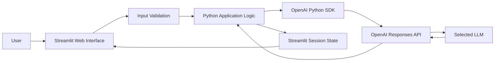

# First LLM App

A simple Streamlit application that turns meeting notes into a structured AI-generated summary using the OpenAI Responses API.

## Features

- Select from approved OpenAI text-generation models
- Paste meeting notes into a browser-based interface
- Generate:
  - Executive summary
  - Key decisions
  - Action items with owners and deadlines
  - Risks and open questions
- Preserve the generated result with Streamlit session state
- Download the analysis as a Markdown file
- Display input, output, and total token usage
- Validate empty and oversized input
- Keep API credentials outside the source code

## Architecture



## Project Structure

```text
first-llm-app/
├── app.py
├── requirements.txt
├── .env
├── .env.example
└── README.md
```

### `app.py`

Contains the Streamlit user interface, validation logic, OpenAI API call, session-state handling, token usage display, and download functionality.

### `requirements.txt`

Lists the direct Python dependencies required by the project.

### `.env`

Contains the real OpenAI API key for local development.

This file must never be committed to GitHub.

### `.env.example`

Documents the environment variables required by the application without exposing real credentials.

### `README.md`

Explains how to configure, install, run, and understand the project.

## Requirements

- Python 3.10 or newer
- An OpenAI API account
- An OpenAI API key with:
  - `List models` — Read
  - `Responses` — Write

## Installation

Run these commands from the repository root.

### 1. Create a virtual environment

```powershell
python -m venv .venv
```

### 2. Activate the virtual environment

```powershell
.\.venv\Scripts\Activate.ps1
```

If PowerShell blocks script execution for the current terminal session:

```powershell
Set-ExecutionPolicy -Scope Process -ExecutionPolicy Bypass
```

Then activate the environment again.

### 3. Install dependencies

```powershell
pip install -r projects/first-llm-app/requirements.txt
```

## Configuration

Create or update:

```text
projects/first-llm-app/.env
```

Add your real API key:

```text
OPENAI_API_KEY=your-real-api-key
```

The `.env.example` file should contain only:

```text
OPENAI_API_KEY=your-api-key-here
```

The root `.gitignore` should include:

```gitignore
.venv/
**/.env
__pycache__/
*.pyc
```

## Run the Application

From the repository root:

```powershell
streamlit run projects/first-llm-app/app.py
```

The application normally opens at:

```text
http://localhost:8501
```

Stop the application with:

```text
Ctrl + C
```

## How It Works

1. Streamlit loads the browser interface.
2. The application loads the API key from `.env`.
3. The OpenAI client requests the models available to the API project.
4. The application filters those models through an approved allowlist.
5. The user selects a model and enters meeting notes.
6. The application validates the input.
7. Application-controlled instructions and user-controlled notes are sent separately to the Responses API.
8. The generated analysis is saved in Streamlit session state.
9. Streamlit renders the Markdown response.
10. The user can download the result and review token usage.

## Model Allowlist

The application does not display every model returned by the Models API.

Instead, it keeps only explicitly approved models, for example:

```python
preferred_models = [
    "gpt-5-mini",
    "gpt-5-nano",
    "gpt-4.1-mini",
]
```

This prevents users from selecting models intended for embeddings, moderation, audio, images, or video.

In a production system, the allowlist would also reflect:

- security approval
- cost limits
- performance testing
- regional availability
- business requirements

## Prompt Design

The application separates fixed application instructions from user input:

```python
response = client.responses.create(
    model=selected_model,
    instructions=MEETING_ASSISTANT_INSTRUCTIONS,
    input=meeting_notes,
)
```

This is clearer than combining instructions and notes into one large string.

It also creates a stronger boundary between:

- application-controlled behavior
- user-provided content

The application instructions tell the model to produce:

- an executive summary
- key decisions
- action items
- risks and open questions
- no invented details

## Session State

Streamlit reruns the Python script whenever a user interacts with many widgets.

The generated result is therefore stored in:

```python
st.session_state.meeting_analysis
```

Token usage is stored in:

```python
st.session_state.usage
```

This keeps the result visible after later reruns in the same browser session.

## Input Validation

The application validates meeting notes before sending anything to OpenAI.

It checks:

- whether the input is empty
- whether the text exceeds the configured character limit

The text area also uses `max_chars` to prevent oversized input in the browser.

This reduces:

- unnecessary API costs
- latency
- accidental large requests
- context-window problems
- basic misuse

## Token Usage

The API response provides:

- input tokens
- output tokens
- total tokens

The application displays these values with Streamlit metrics.

Token usage is useful for:

- estimating cost
- detecting unusually large prompts
- monitoring application behavior
- setting future usage limits

Pricing is not returned directly by the response, so any cost calculation requires a separate model-pricing configuration.

## Security

This project applies several basic security practices:

- API credentials are stored outside the source code
- `.env` is ignored by Git
- `.env.example` contains no secret values
- the API key uses restricted permissions
- models are filtered through an allowlist
- user input is validated before the API call
- application instructions are separated from user input

For production deployment, secrets should be stored in the hosting platform's secret-management system rather than in a local `.env` file.

## Main Dependencies

### Streamlit

Provides the web interface, widgets, spinner, session state, Markdown rendering, download button, columns, and metrics.

### OpenAI

Provides the Python client used to call the Models API and Responses API.

### python-dotenv

Loads the local API key from the `.env` file into the application environment.

## Key Concepts Demonstrated

- Python virtual environments
- dependency management
- environment variables
- secret management
- API clients
- endpoints
- restricted API permissions
- model discovery
- model allowlisting
- prompt design
- Streamlit reruns
- session state
- input guardrails
- token usage
- exception handling
- functions
- constants
- separation of concerns

## Known Limitations

- The application has no user authentication.
- Session state is temporary and tied to the active browser session.
- Meeting notes are sent to an external API.
- There is no persistent database.
- There is no automated cost calculation.
- There is no structured JSON schema for the model output.
- There are no automated tests.
- The application is currently designed for local execution.

## Possible Next Improvements

- Deploy the app to Streamlit Community Cloud
- Add model-specific cost estimation
- Add structured output validation
- Add a clear-results button
- Export to PDF or DOCX
- Add authentication
- Store previous analyses in a database
- Add personally identifiable information detection
- Add automated tests
- Move API and validation logic into separate modules
- Add logging and monitoring

## Related Learning Content

The full learning walkthrough, architecture decisions, and lessons learned belong in:

```text
content/01-ai-fundamentals/challenge-01-first-llm-app.md
```

That page is intended for the AI Architecture Playbook website, while this README is the operational guide for the working project.
